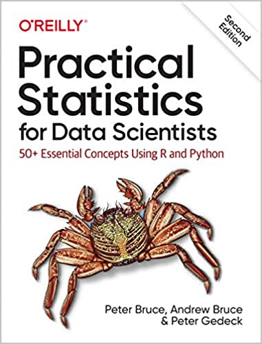

# Code repository
<table width='100%'>
 <tr>
  <td></td>
  <td>
   <p><b>Practical Statistics for Data Scientists:</b></p>

   <p>50+ Essential Concepts Using R and Python<br>
by Peter Bruce, Andrew Bruce, and <a href="https://www.amazon.com/Peter-Gedeck/e/B082BJZJKX/?&_encoding=UTF8&tag=petergedeck-20&linkCode=ur2&linkId=089cd2d466348aa1e598aab0a42aa207&camp=1789&creative=9325">Peter Gedeck</a></p>

   <ul>
    <li>Publisher: <a href="https://oreil.ly/practicalStats_dataSci_2e">O'Reilly Media</a>; 2nd edition (June 9, 2020)</li>
   <li>ISBN-13: 978-1492072942</li>
    <li>Buy on 
     <a href="https://www.amazon.com/Practical-Statistics-Data-Scientists-Essential/dp/149207294X?&_encoding=UTF8&tag=petergedeck-20&linkCode=ur2&linkId=71ac36e6b2d734c5dc9d7d432a1a860c&camp=1789&creative=9325">Amazon</a></li>
   <li>Errata: <a href="http://oreilly.com/catalog/errata.csp?isbn=9781492072942">http://oreilly.com/catalog/errata.csp?isbn=9781492072942</a></li>
   </ul>
    </td>
  </tr>
</table>


## Online
View the notebooks online:
[](https://nbviewer.org/github/egeekle/Estadistica-para-Ciencia-de-Datos/tree/main/)

Excecute the notebooks in Binder:
[](https://mybinder.org/v2/gh/Egeekle/Estadistica-para-Ciencia-de-Datos.git/HEAD)

 This can take some time if the binder environment needs to be rebuilt.


## See also
- The code repository for the first edition is at: <a href="https://github.com/andrewgbruce/statistics-for-data-scientists">https://github.com/andrewgbruce/statistics-for-data-scientists</a>


# Setup of R and Python environments

We recommend using a conda environment to run the Python and R code.

```
conda create -n sfds #Create the conda environment named sfds.
conda activate sfds #Activate the environment we created.
conda env update -n sfds -f environment.yml #Update the depencies of the environment from environment.yml 
```

The full list of Python and R dependencies from the [environment.yml](environment.yml) file:

```
python
jupyter
pandas
matplotlib
scipy
statsmodels
wquantiles
seaborn
scikit-learn
pygam
dmba
pydotplus
imbalanced-learn
prince
xgboost
graphviz
numpy
adjustText
r-essentials
r-base
r-vioplot
r-corrplot
r-gmodels
r-matrixstats
r-lmperm
r-pwr
r-fnn
r-klar
r-dmwr
r-xgboost
r-ellipse
r-mclust
r-ca
r-ggplot2
r-irkernel
r-boot
r-randomforest
```
